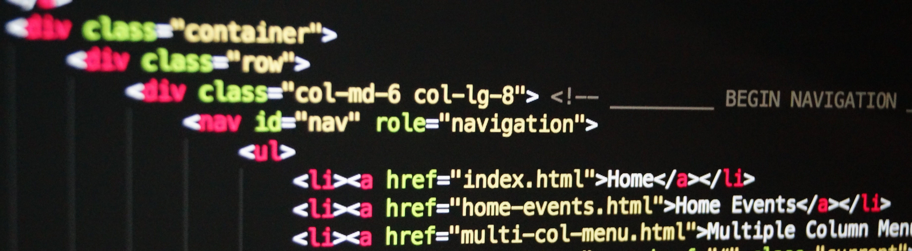

<!--  <!-- I don't know why this doesn't work and it sucks -->
 <!-- I'm not going to waste all my time on a banner. All the good ones needed iStock. And the video I took just doesn't work... -->

## About me
I'm Ehren, a Software Developer student at MITT. I am passionate about creating webpages and games from the ground up.

I have experience programming in JavaScript, Java, C# and C++ but when making games, I prefer coding in JavaScript and C++ for their different things they have to offer. I want to learn assembly languages in the future so that I can truely build a game from nothing.

My website (work in progress): https://cubebotfan.github.io/

## My skills
I have experience programming in JavaScript, Java, C++, and C#. As a web developer I also have skills in HTML, CSS, .Net, and SQL.

  &nbsp;
  &nbsp;
  &nbsp;
  &nbsp;
  &nbsp;
  &nbsp;
  &nbsp;
  &nbsp;

## My projects

### wizard-js-remake
A JavaScript remake of the wizard game I created in Java. Currently my main project using xander-js-3, a JavasScript game library that I made. I want to develop this project to something I can consider a finished game.  
=https://cubebotfan.github.io/wizard-js-remake/

### Typing game
A typing game prototype that I plan to turn it into a full html game. Currently has a high score system using local storage but I might port the project to mvc to create a global leaderboard maybe. Developing the game comes first though.  
https:/cubebotfan.github.io/typing-game-2.0/

### Delish Delivery
A dessert themed website I designed.  
https://cubebotfan.github.io/delish-delivery/

##

